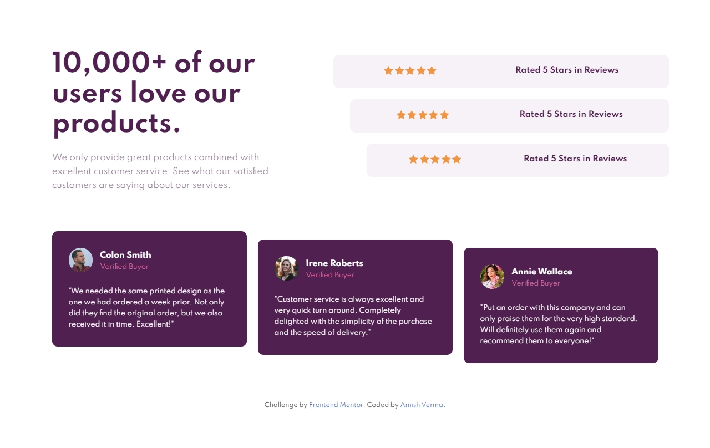
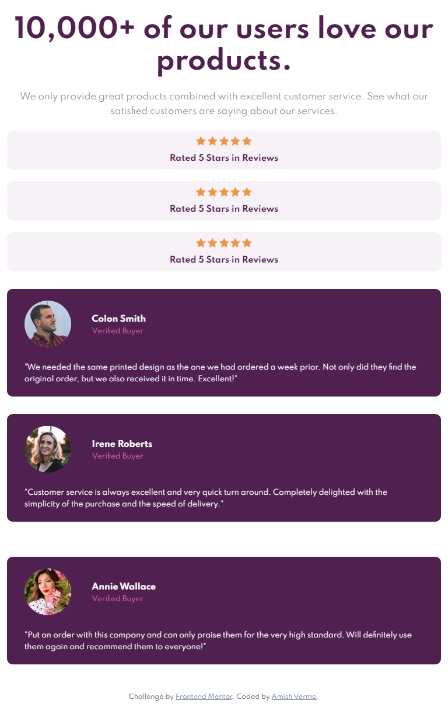
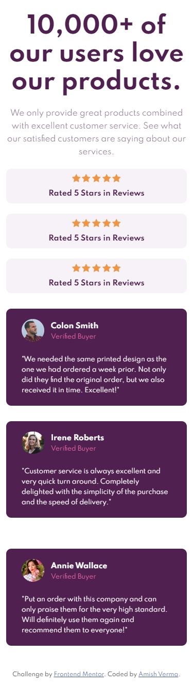

# Frontend Mentor - Social proof section solution

This is a solution to the [Social proof section challenge on Frontend Mentor](https://www.frontendmentor.io/challenges/social-proof-section-6e0qTv_bA). Frontend Mentor challenges help you improve your coding skills by building realistic projects.

## Table of contents

- [Overview](#overview)
  - [The challenge](#the-challenge)
  - [Screenshot](#screenshot)
  - [Links](#links)
- [My process](#my-process)
  - [Built with](#built-with)
  - [What I learned](#what-i-learned)
  - [Continued development](#continued-development)
  - [Useful resources](#useful-resources)
- [Author](#author)
- [Acknowledgments](#acknowledgments)

## Overview

### The challenge

Users should be able to:

- View the optimal layout for the section depending on their device's screen size

### Screenshot





### Links

- Solution URL: [Add solution URL here](https://your-solution-url.com)
- Live Site URL: [Add live site URL here](https://your-live-site-url.com)

## My process

### Built with

- Semantic HTML5 markup
- CSS custom properties
- Flexbox

### What I learned

I was able to pratice more on my HTML5 and CSS3 skills to get better in desgning and developing new layouts.

To see how you can add code snippets, see below:

```css
.testimonial + .testimonial {
  margin-left: 2rem;
}
```

I got to know how more efficiently we could use the css combinators to style our page. I have used the adjacent sibling selector to add margins for correct layout.

### Continued development

I would love to work more on my css skills to practice to how to make good responsive designs in the future.

### Useful resources

- [Example resource 1](https://www.w3schools.com/css/css_combinators.asp) - This helped me to understand more about css combinators and clear some of my previous misconceptions about the css selectors reason.

## Author

- Frontend Mentor - [@amishverma](https://www.frontendmentor.io/profile/amishverma)
- Instagram [amish_verma](https://www.instagram.com/amish_verma/)
